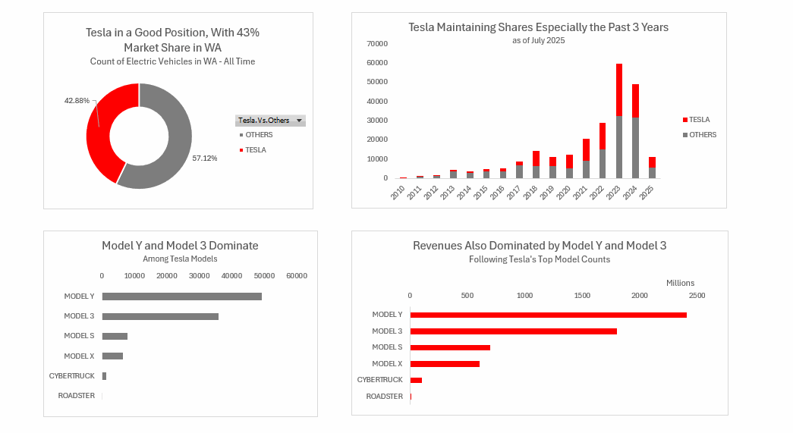

# Market Size, Share and Revenue Estimates of Electric Vehicles in WA - Focus on Tesla
##  Uses Real World data  (235K+ rows of data)

## 

## Objective: This dashboard addresses the following business questions using data from this [website](https://catalog.data.gov/datasets/lectroc-vehicle-population-data). 
- What is Tesla's market share in WA compared to other brands?
- Which Tesla models are most popular, and what is the estimated revenue impact?
- How do Tesla's vehicle prices and ranges compare to competitors?
- How are PHEV (hybrids) and BEVs trending?
- Which utilites are most commonly associated with Tesla vehicle registrations?
- What is the forecast for Tesla in 2025?

## Key challenge:  Since a lot of the price information and electric range information are missing, I researched the prices and electric ranges beyond the dataset provided.

## Excel workflow
For the msrp charts, I linked the original dataset with the researched price data using xlookup.
I filtered only battery electric vehicles for fair comparison and researched the electric ranges for these missing models and makes.
Using the added data, I then created this dashboard, using excel pivot tables and pivot charts.

## Findings as of July 2025:
- Tesla has almost half of market share in terms of counts, all years.
- Tesla maintained this share level as of report date.
- Tesla is in mid to upper range in terms of price among the USD <100K price segment.
- Tesla is also in mid to upper range in terms of electric range in miles within BEV.
- BEV continues to outpace hybrids. The spike in 2023 is due to the tax incentives.
- The partnership with Puget Sound utilties is evident in the associated utilities with Tesla cars.
- 2025 forecast for Tesla is around 20k compared to 17k in 2024. [exponential smoothing 'forecast.ets' function in excel](https://support.microsoft.com/en-us/office/forecast-ets-function-15389b8b-677e-4fbd-bd95-21d464333f41)  Since exponential smoothing gives rapidly decreasing attention to older data, the forecast is higher.

