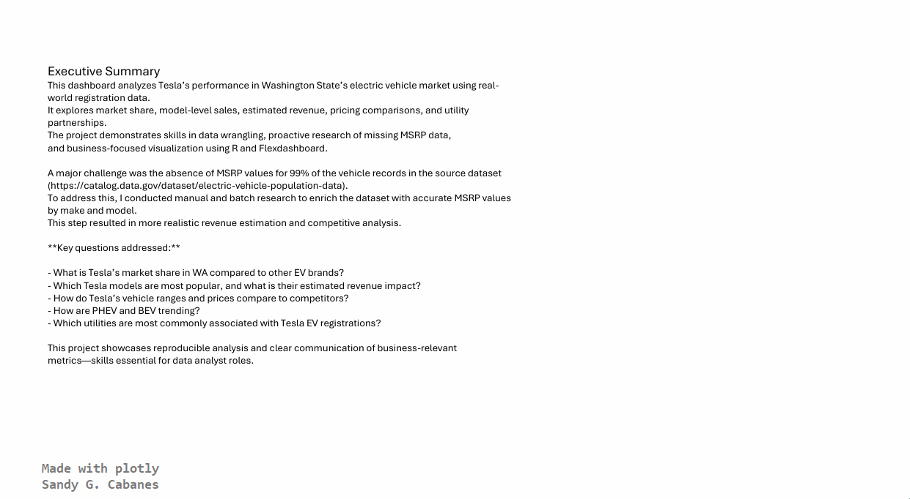

# Market Share and Revenue Outlook for Electric Vehicles in Washington State  
## Analyst’s Report for Stakeholders

### Executive Overview  
This report evaluates the competitive position of electric vehicle manufacturers in Washington State, with a focus on Tesla’s market share, model‑level revenue potential, and near‑term sales outlook. The analysis uses the state’s EV registration data, enriched with independently researched MSRP and electric‑range values to correct for missing information in the source dataset.  

Objective is to provide a clear view of where Tesla is gaining or losing ground, how its pricing and range compare to competitors, and what the 2025 sales trajectory might look like based on historical adoption patterns.

---

## Key Findings  
### 1. Tesla remains the dominant EV brand in Washington  
Tesla holds the largest share of registered EVs in the state, driven primarily by the Model Y and Model 3. These two models account for the majority of Tesla’s estimated revenue contribution.

### 2. Revenue concentration is high in a small number of models  
After enriching the dataset with MSRP values, revenue estimates show that Tesla’s portfolio is heavily concentrated in its crossover and sedan lines. This concentration increases exposure to competitive pressure in those segments.

### 3. Tesla maintains a strong range‑to‑price position  
Supplemented electric‑range data shows that Tesla continues to outperform many competitors on range per dollar, particularly against newer BEV entrants. This remains a core competitive advantage.

### 4. BEVs continue to outpace PHEVs in adoption  
Washington’s EV landscape is shifting steadily toward BEVs. Tesla benefits from this trend, while PHEV‑heavy competitors face slower growth.

### 5. Utility associations show geographic and infrastructure patterns  
Registration data indicates consistent alignment with specific utilities, reflecting regional adoption clusters and charging‑infrastructure maturity.

### 6. 2025 sales outlook shows continued growth, but at a moderated pace  
ARIMA‑based forecasting suggests that Tesla will continue to grow in 2025, though not at the pace implied by the 2023 spike. Adjustments were applied to avoid overfitting to anomalous events.

---

## Implications  
- Tesla’s strong market share and range‑to‑price advantage position it well for continued growth, but revenue concentration in two models increases competitive risk.  
- Competitors with expanding BEV portfolios may erode Tesla’s lead unless Tesla continues to refresh its lineup and maintain pricing discipline.  
- Utilities and policymakers can use the geographic clustering insights to prioritize charging infrastructure investments.  
- OEMs entering the Washington market should focus on BEV offerings with competitive range and pricing, as PHEV momentum continues to decline.

---

## Data Foundation  
The source dataset lacked MSRP and electric‑range values for most entries. To ensure realistic revenue and range comparisons:

- MSRP values were researched and mapped by make and model.  
- Electric‑range data was supplemented from external sources.  
- Forecasting models were calibrated to avoid overstating growth due to one‑year anomalies.

This enriched dataset forms the basis for all dashboards and forecasts.

---

## Visual Dashboards  
Dashboards were produced across multiple platforms to support different stakeholder environments. All versions use the same enriched dataset and produce consistent insights.
### R dashboard using flexdashboard

---
### Excel dashboard using pivot charts
#### The excel forecast used native forecast.ets function, resulting in slightly higher figures.

---
### Python dashboard using plotly

---

## Appendix: Technical Workflow  
A multi‑tool workflow was implemented to ensure reproducibility and cross‑platform consistency.  
- Data cleaning and enrichment  
- MSRP and range mapping  
- Time‑series modeling (ARIMA)  
- Dashboard development in R, Python, Excel, Tableau, and Power BI  

---

### Data Enrichment and Methodology  
The source dataset ([Electric Vehicle Population Data](https://catalog.data.gov/dataset/electric-vehicle-population-data)) lacked MSRP and electric range data for the majority of entries. To address this:

- **MSRP values** were manually researched and mapped by make and model to enable revenue estimation.
- **Electric range data** was supplemented using external sources to support realistic range comparisons.

Sales projections were generated using ARIMA modeling, with adjustments to temper the 2023 spike and avoid overfitting to anomalous events.

---

### Sections

- R [See R codes and dashboard](/R)  Transparent, reproducible workflows using flexdashboar
- Python [See python codes and dashboard](/Python) Interactive visualizations with Plotly 
- Excel [Excel dashboard](/Excel) Familiar pivot-based interface for quick sharing
- Tableau [See Tableau report](Tableau Public link) - Under construction 
- Power BI [See Power BI report](/PowerBI)  - Under construction
