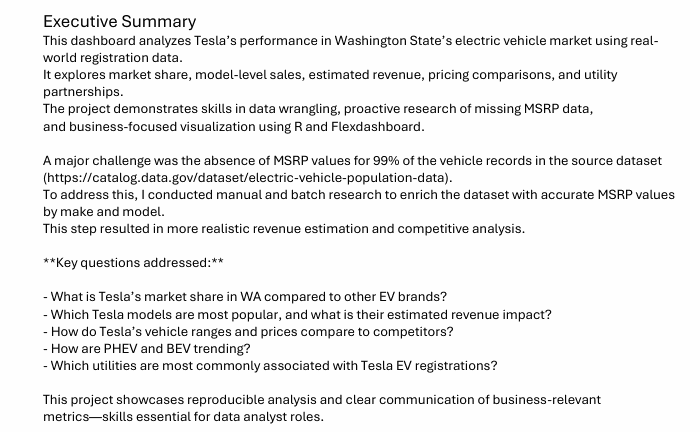
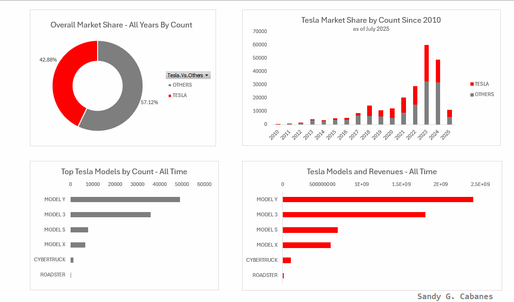

# Market Size, Revenue and Share Estimates of Electric Vehicles in WA (Real World Data)

## What This is About:
This analyzes Tesla’s performance in Washington State’s electric vehicle market using real-world registration data. 
It explores market share, model-level sales, estimated revenue, pricing comparisons, and utility partnerships. 
The project demonstrates skills in data wrangling, proactive research of missing MSRP data, research of missing Electric.Range data,
and business-focused visualization.  Methods used are:
- R [See R codes](/R)
- Python [See python codes and dashboard](/Python)  - to follow
- Excel [Excel Readme](/Excel)
- Tableau [See Tableau report](Tableau Public link) - to follow
- Power BI [See Power BI report](/PowerBI)  - to follow

## Key Challenge
The [source dataset](https://catalog.data.gov/dataset/electric-vehicle-population-data) lacked price data for 99% of the rows: a major challenge.
To solve this, I conducted manual and batch research to enrich the dataset with accurate MSRP values by make and model. 
This step resulted in more realistic revenue estimation and competitive analysis.

## Key Business Questions Addressed:

- What is Tesla’s market share in WA compared to other EV brands?
- Which Tesla models are most popular, and what is their estimated revenue impact?
- How do Tesla’s vehicle ranges and prices compare to competitors?
- How are PHEV and BEV trending?
- Which utilities are most commonly associated with Tesla EV registrations?

This project showcases reproducible analysis and clear communication of business-relevant 
metrics—skills essential for data analyst roles.

### R dashboard using flexdashboard

### Excel dashboard using pivot charts

