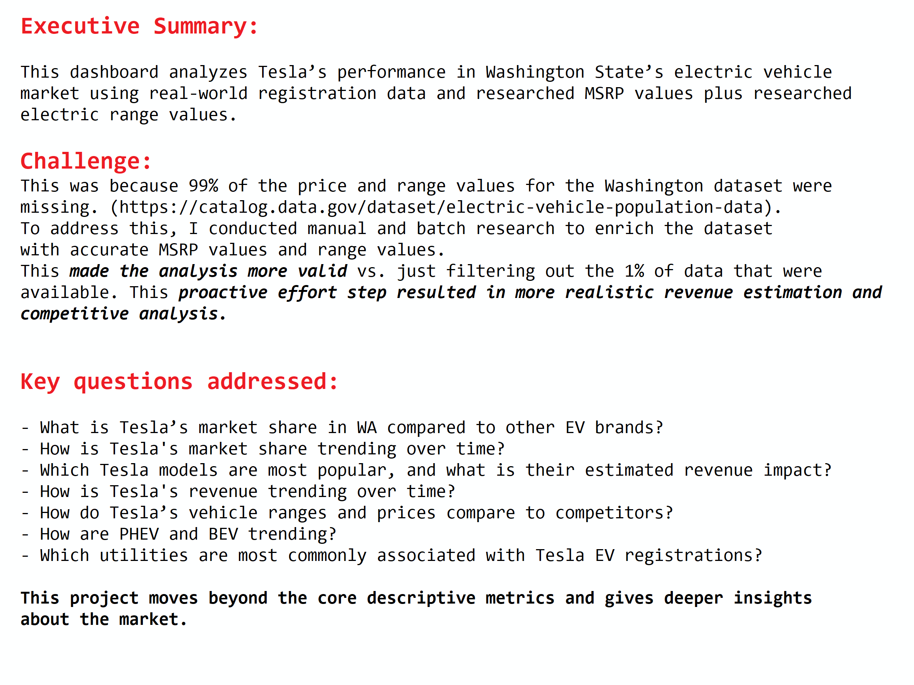

# Market Size, Share Estimates and Sales Forecast of Electric Vehicles in WA (Real World Data)
## This repo features Python, R, Excel, Power BI and Tableau to solve the same business questions.
## What This is About:
This analyzes Tesla’s performance in Washington State’s electric vehicle market using real-world registration data. 
It explores market share, model-level sales, estimated revenue, pricing comparisons, and utility partnerships. 
The project showcases data wrangling, proactive research of missing MSRP data, proactive research of missing Electric.Range data,
and business-focused visualization.  Each of these methods produced similar dashboards.
- R [See R codes and dashboard](/R)  - for those interested in transparent reproducible workflows 
- Python [See python codes and dashboard](/Python) 
- Excel [Excel dashboard](/Excel) - for those interested in familiar tools and quick shareable dashboards
- Tableau [See Tableau report](Tableau Public link) - under construction 
- Power BI [See Power BI report](/PowerBI)  - under construction 

## Key Advantages of This Analysis
The [source dataset](https://catalog.data.gov/dataset/electric-vehicle-population-data) **lacked price data for 99% of the rows:** a major challenge.
To solve this, **I conducted web research to enrich the dataset with accurate MSRP values by make and model.** 
The dataset also lacked important electric range data needed for comparing ranges. This required extra research beyond what is given in the dataset so that I get a more realistic comparison of Tesla vs. others. 

## Business Questions Addressed:

- What is Tesla’s market share in WA compared to other EV brands?
- Which Tesla models are most popular, and what is their estimated revenue impact?
- How do Tesla’s vehicle ranges and prices compare to competitors?
- How are PHEV and BEV trending?
- Which utilities are most commonly associated with Tesla EV registrations?
- What is the 2025 sales outlook for Tesla assuming previous Tesla trends?

This project showcases advanced analysis aside from the usual exploratory methods.  I added the sales projections using ARIMA and tempered the spike in 2023 to eliminate the one-time anomaly.  

---

### R dashboard using flexdashboard

---
### Excel dashboard using pivot charts
#### The excel forecast used native forecast.ets function, resulting in slightly higher figures.

---
### Python dashboard using plotly

